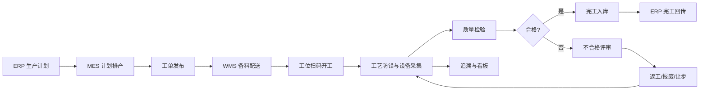
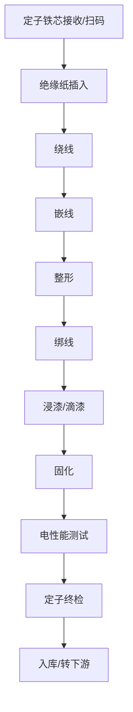
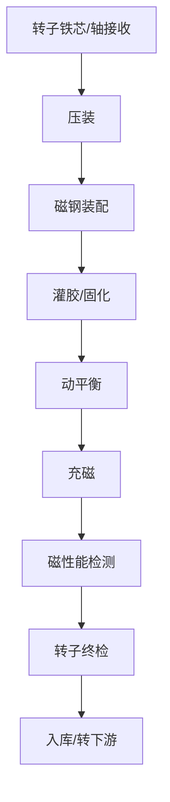
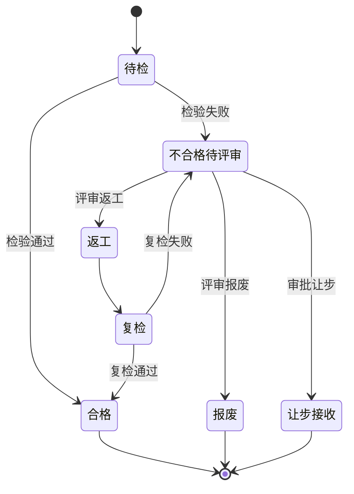

# 业务蓝图

## 1. 蓝图目标

业务蓝图用于将定转子制造业务从现状流程转化为 MES 目标流程，明确端到端业务场景、组织职责、主数据、流程规则、异常闭环和关键绩效指标，作为后续配置、开发和测试的业务基线。

## 2. 端到端业务架构

## 3. 组织与职责蓝图

| 组织 | 核心职责 | MES 责任边界 |
| --- | --- | --- |
| 计划部 | 计划接收、排产、交期协调 | 维护计划、工单、优先级和进度确认。 |
| 制造部 | 现场执行、班组管理、异常响应 | 负责派工、报工、过站、防错执行和异常提报。 |
| 工艺部 | 工艺路线、SOP、参数标准 | 维护工艺模型、参数上下限、工装设备约束。 |
| 质量部 | 检验、放行、不合格处理 | 维护检验标准，执行检验，审批质量处置。 |
| 设备部 | 设备状态、保养、维修 | 维护设备档案、采集点、停机原因和点检计划。 |
| 仓储物流 | 备料、配送、退料、入库 | 确认线边物料、投退料、完工入库和库存同步。 |
| IT 部 | 系统运维、接口、安全 | 负责账号权限、接口监控、备份恢复和技术支持。 |

## 4. 主流程蓝图

### 4.1 计划到工单

1. ERP 下发生产计划，包含产品、数量、交期、客户订单和优先级。
2. MES 校验产品、BOM、工艺路线、资源能力和班次日历。
3. 计划员按产线、班次、批量规则拆分工单。
4. 计划员发布工单后，系统生成批次号、条码规则和质量任务触发规则。
5. 工单状态从“待发布”流转为“已发布”，工位终端可见。

### 4.2 备料到投料

1. MES 根据工单 BOM 生成备料需求并推送 WMS。
2. WMS 按批次拣配物料并配送至线边库。
3. 操作员或仓库人员在工位扫描物料批次码完成投料绑定。
4. MES 校验物料编码、版本、有效期、批次状态、替代料规则和用量。
5. 投料成功后形成产品批次与物料批次谱系关系。

### 4.3 定子制造流程

关键控制点：绕线张力、匝数、线径批次、槽满率、整形尺寸、浸漆温度、固化曲线、绝缘电阻、耐压、相间电阻。

### 4.4 转子制造流程

关键控制点：压装力位移曲线、磁钢批次与极性、胶量、固化时间温度、动平衡量、充磁电流、磁通量、外径跳动。

### 4.5 质量闭环流程

## 5. 主数据蓝图

| 主数据 | 关键字段 | 维护规则 |
| --- | --- | --- |
| 产品主数据 | 产品编码、名称、型号、客户料号、版本、产品族 | 来源 ERP/PLM，MES 只维护执行属性。 |
| BOM | 父项、子项、用量、损耗、替代料、生效日期 | 以 ERP/PLM 为准，MES 保存版本快照。 |
| 工艺路线 | 路线编码、版本、工序、顺序、返工路线 | 工艺部维护，发布后禁止直接修改历史版本。 |
| 工序 | 工序编码、名称、节拍、资源组、过站规则 | 与工位、设备、质量和采集点关联。 |
| 设备 | 设备编码、名称、产线、协议、状态、能力 | 设备部维护，停用设备不可排产。 |
| 工装模具 | 编码、寿命、校验日期、适用产品 | 超寿命或校验过期禁止使用或需审批。 |
| 人员资质 | 员工、岗位、工序资格、有效期 | 过期资质禁止关键工序操作。 |
| 缺陷代码 | 缺陷类别、缺陷项、责任归属、处置建议 | 质量部统一维护，用于报表分析。 |

## 6. 业务规则

| 场景 | 规则 |
| --- | --- |
| 工序过站 | 必须满足上一工序完成、当前工序允许、产品状态正常、物料绑定完整。 |
| 参数采集 | 关键参数必须自动采集或经授权手工录入，超限后默认禁止过站。 |
| 物料投料 | 物料批次必须合格、未冻结、未过期，替代料必须满足已批准替代关系。 |
| 质量放行 | 首检未通过时，批量生产工序不得继续报工，除非质量授权临时放行。 |
| 返工 | 返工必须选择返工路线、原因代码和审批人，返工后必须复检。 |
| 报废 | 报废需记录数量、原因、责任工序、责任设备和审批记录，并回传 ERP。 |
| 设备状态 | 设备故障或保养状态不可开工；已开工工单需暂停并记录停机原因。 |
| 追溯 | 单件或批次履历必须保留人员、时间、设备、物料、参数、质量和异常。 |

## 7. KPI 蓝图

| 指标 | 计算口径 | 展示维度 |
| --- | --- | --- |
| 计划达成率 | 实际完成数量 / 计划数量 | 日期、产线、产品、班组。 |
| 一次合格率 | 首次检验合格数量 / 检验总数量 | 工序、产品、设备、班组。 |
| 直通率 | 无返工无返修合格数量 / 投入数量 | 产品、路线、班次。 |
| OEE | 可用率 × 性能稼动率 × 良品率 | 设备、产线、班次。 |
| 参数采集完整率 | 已采集关键参数数 / 应采集关键参数数 | 工序、设备、产品。 |
| 异常关闭及时率 | SLA 内关闭异常数 / 异常总数 | 异常类型、责任部门。 |

## 8. 目标业务差异与改进

| 现状问题 | 目标方案 | 预期收益 |
| --- | --- | --- |
| 纸质记录分散 | 工位电子记录和自动采集 | 降低人工录入和追溯时间。 |
| 工序防错依赖经验 | 扫码、资质、物料、工装和参数规则防错 | 降低错料、漏工序、参数超限风险。 |
| 质量数据滞后 | 检验任务自动触发和结果实时判定 | 缩短质量响应时间。 |
| 设备数据孤岛 | 网关统一采集并关联工单和产品 | 支撑 OEE 和参数追溯。 |
| 追溯靠人工汇总 | 单件/批次谱系自动生成 | 提升客户审核和召回分析能力。 |
