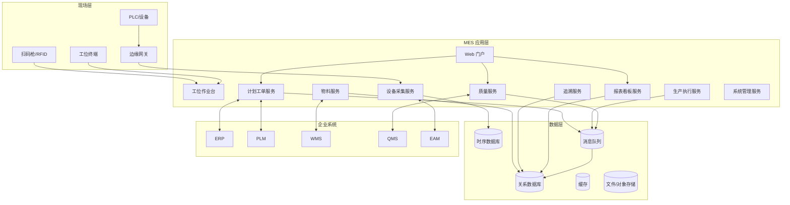
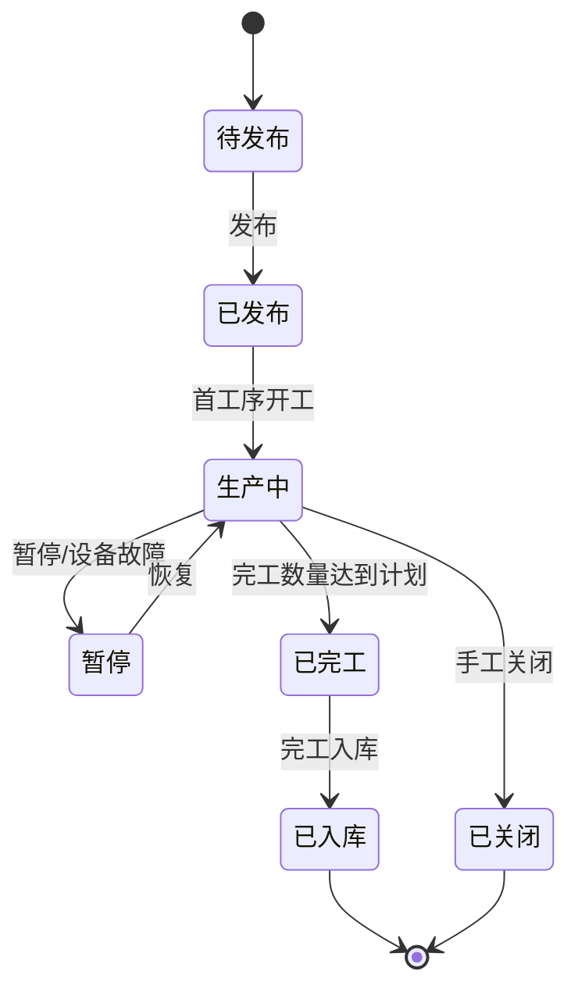
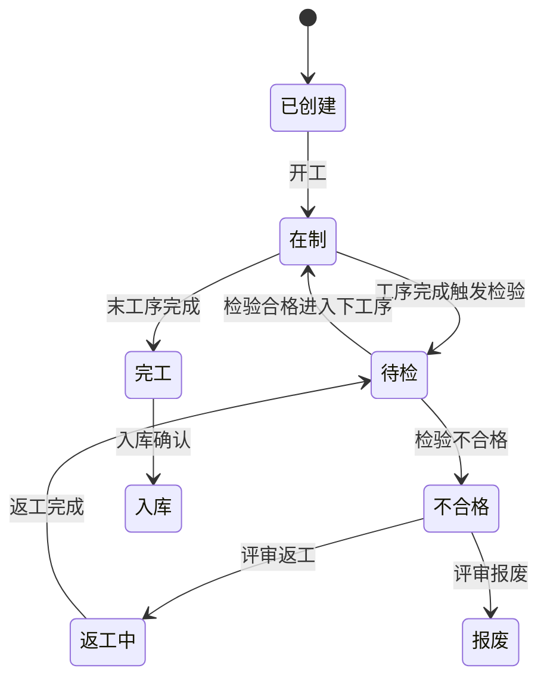

# 系统设计说明书

## 1. 设计目标

系统设计以稳定、高可用、可追溯、易扩展为原则，构建覆盖计划、执行、质量、设备、物料、追溯、报表和系统管理的 MES 平台。设计需支持车间触摸屏、移动终端、大屏看板和后台管理多种访问方式。

## 2. 总体架构

## 3. 应用模块设计

| 模块 | 子功能 | 设计说明 |
| --- | --- | --- |
| 计划工单 | 计划接收、工单拆分、排产、发布、进度反馈 | 工单作为生产执行主对象，状态机驱动全流程。 |
| 工艺建模 | 工艺路线、工序、SOP、参数、规则、版本 | 发布版本不可变，执行时引用工单快照。 |
| 生产执行 | 工位作业、扫码防错、过站、报工、返工、异常 | 工位终端按任务上下文加载最小必要信息。 |
| 物料管理 | 备料需求、投料、退料、线边库存、批次绑定 | 通过批次谱系支撑正反向追溯。 |
| 质量管理 | 检验计划、检验任务、判定、不合格、8D | 检验任务可由工单、工序、批量、时间或异常触发。 |
| 设备管理 | 设备台账、采集点、状态、报警、点检保养 | 设备事件与工单、产品、班次关联。 |
| 追溯管理 | 单件履历、批次谱系、影响分析、追溯报告 | 采用图谱式关系表与聚合索引提升查询性能。 |
| 看板报表 | 计划、产量、质量、设备、异常、追溯报表 | 指标口径统一，支持权限过滤和导出。 |
| 系统管理 | 组织、用户、角色、字典、日志、编码规则 | 支持 RBAC、数据权限和审计追踪。 |

## 4. 关键状态机

### 4.1 工单状态

### 4.2 产品单件状态

## 5. 数据模型设计

### 5.1 核心实体

| 实体 | 主要字段 | 关系 |
| --- | --- | --- |
| product | product_code、name、model、version、customer_part_no | 与 BOM、路线、工单关联。 |
| process_route | route_code、version、product_code、status、effective_date | 包含多个 process_operation。 |
| process_operation | operation_code、sequence、workstation_group、standard_cycle_time | 关联 SOP、参数、质量特性。 |
| production_order | order_no、product_code、plan_qty、status、line_code、due_date | 关联批次、报工、物料、质量。 |
| serial_lot | serial_no、lot_no、order_no、product_code、status | 单件或批次追溯主体。 |
| operation_record | serial_no、operation_code、start_time、end_time、operator、equipment_code | 记录过站履历。 |
| material_binding | serial_no、material_code、material_lot、qty、bind_time | 建立物料谱系。 |
| equipment_sample | equipment_code、tag_code、value、timestamp、order_no、serial_no | 存储关键参数和状态。 |
| inspection_task | task_no、order_no、operation_code、inspection_type、status | 关联检验结果。 |
| inspection_result | task_no、item_code、value、judgement、inspector | 形成质量记录。 |
| nonconformance | nc_no、serial_no、defect_code、disposition、status | 关联返工、报废、让步流程。 |
| trace_relation | parent_type、parent_id、child_type、child_id、relation_type | 支撑谱系图查询。 |

### 5.2 数据保留策略

1. 工单、报工、检验、不合格、追溯关系数据保存不少于 15 年或按客户要求执行。
2. 高频设备原始时序数据保存 2 年，关键参数聚合结果与产品履历同周期保存。
3. 操作日志、接口日志保存不少于 1 年，安全审计日志保存不少于 3 年。
4. 文件、图片、SOP、检验附件采用对象存储并保留版本。

## 6. 接口设计

### 6.1 接口原则

1. 企业系统接口优先采用 REST/JSON 或消息队列；高频采集采用 OPC UA、MQTT 或工业网关协议。
2. 所有接口必须具备唯一请求号、时间戳、来源系统、幂等键和错误码。
3. 接口失败需进入重试队列和人工处理队列，避免现场作业被单点故障阻断。
4. 关键业务接口需保存原始报文、解析结果、处理状态和重试记录。

### 6.2 典型接口

| 接口 | 方法 | 关键字段 | 异常处理 |
| --- | --- | --- | --- |
| 生产计划下发 | ERP POST /mes/plans | plan_no、product_code、qty、due_date | 数据校验失败返回错误明细，不创建计划。 |
| 完工回传 | MES POST /erp/completions | order_no、good_qty、scrap_qty、warehouse | ERP 失败时进入重试队列。 |
| 工艺版本同步 | PLM POST /mes/routes | route_code、version、operations、sop_files | 版本冲突时创建待确认任务。 |
| 备料请求 | MES POST /wms/picking | order_no、material_code、required_qty | WMS 缺料返回缺料状态并预警计划员。 |
| 检验标准同步 | QMS POST /mes/inspection-standards | item_code、spec_limit、method | 标准未发布不可用于生产。 |
| 设备参数上报 | Edge MQTT topic mes/equipment/{code}/tags | tag_code、value、timestamp | 边缘缓存断网数据，恢复后补传。 |

## 7. 安全设计

1. 使用基于角色的访问控制，角色包括计划员、班组长、操作员、检验员、工艺工程师、设备工程师、仓库人员、管理员等。
2. 数据权限按工厂、车间、产线、班组和产品族控制。
3. 关键操作包括工单关闭、参数手工修改、质量让步、报废审批、主数据发布，必须记录审计日志。
4. 接口调用使用签名、令牌或双向证书，生产网与办公网之间通过受控网关访问。
5. 工位终端支持自动锁屏和人员换班重新认证。

## 8. 部署设计

| 组件 | 推荐部署 | 高可用建议 |
| --- | --- | --- |
| Web/API 服务 | 容器化或虚拟机集群 | 负载均衡，多实例无状态。 |
| 数据库 | 独立数据库服务器 | 主从复制、定期备份、灾备演练。 |
| 消息队列 | 独立消息集群 | 多副本、消息持久化。 |
| 时序数据库 | 采集数据专用节点 | 分区存储、冷热分层。 |
| 边缘网关 | 产线侧工业 PC | 本地缓存、断点续传、看门狗。 |
| 文件存储 | 对象存储或 NAS | 多副本、生命周期管理。 |

## 9. 可观测性设计

1. 应用日志统一输出 trace_id、user_id、order_no、serial_no 和接口请求号。
2. 监控指标覆盖接口成功率、扫码响应时间、数据库连接、队列堆积、采集延迟和设备离线率。
3. 告警分级包括 P1 生产阻断、P2 关键功能异常、P3 一般功能异常、P4 提示类告警。
4. 建立生产日巡检清单，覆盖服务、接口、采集、数据库备份和磁盘容量。
