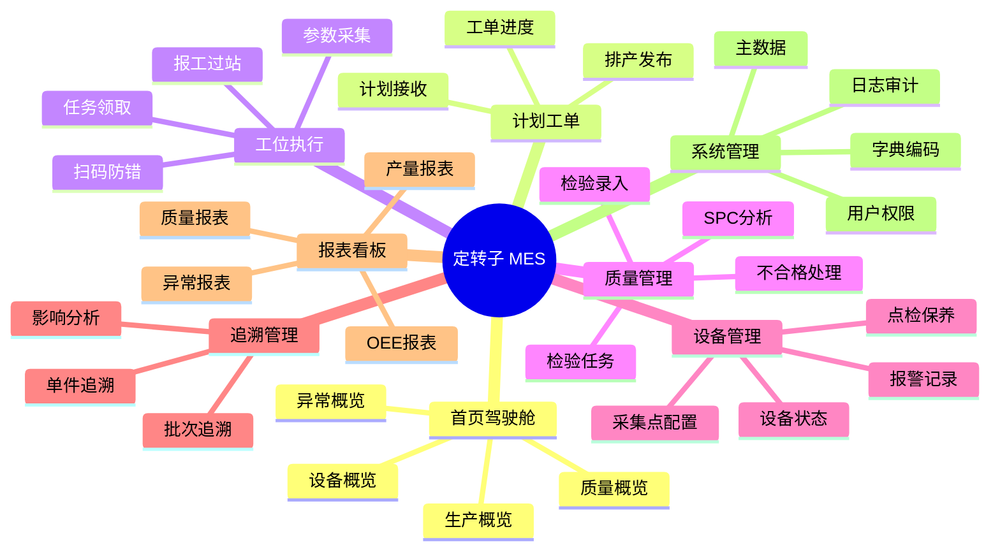

# UI 原型与交互说明

## 1. 设计原则

1. 工位端优先保证少点击、强提示、大按钮、可触摸和弱网络容错。
2. 管理端优先保证信息密度、筛选分析、批量操作和导出能力。
3. 看板端优先保证大屏可读性、实时刷新、异常突出和指标口径一致。
4. 所有关键操作必须给出成功、失败、待处理三类明确反馈。

## 2. 信息架构



## 3. 核心页面原型

### 3.1 首页驾驶舱

```text
┌─────────────────────────────────────────────────────────────────────────┐
│ 定转子 MES 首页       工厂: 一厂  车间: 电驱车间  班次: 白班  用户: 张三 │
├───────────────┬───────────────┬───────────────┬───────────────────────┤
│ 今日计划 1200 │ 已完成 860    │ 计划达成 71%  │ 异常未关 6            │
├───────────────┴───────────────┴───────────────┴───────────────────────┤
│ 产线进度                                                                  │
│ L1 定子线 ███████████░ 82%  异常 1  一次合格率 98.2%                    │
│ L2 转子线 ███████░░░░░ 58%  异常 3  一次合格率 96.7%                    │
├─────────────────────────────────────────────────────────────────────────┤
│ [工单预警] [质量预警] [设备报警] [缺料预警]                              │
│ WO20260516001 交期风险 | EQP-R-008 故障停机 | MAT-CU-001 缺料           │
└─────────────────────────────────────────────────────────────────────────┘
```

交互规则：指标卡点击进入对应明细；异常列表按严重度排序；刷新周期默认 30 秒。

### 3.2 工单排产页面

```text
┌──────────────────────────────────────────────────────────────────────┐
│ 计划工单 > 排产发布                                                   │
├──────────────────────────────────────────────────────────────────────┤
│ 筛选: [日期] [产品] [产线] [状态]                         [查询][重置]│
├───────────────────────────┬──────────────────────────────────────────┤
│ 待排计划                   │ 排产甘特图                               │
│ □ PLN001 定子A 500 5/18    │ L1 白班 | WO001 定子A 300 | WO002 200     │
│ □ PLN002 转子B 400 5/18    │ L2 夜班 | WO003 转子B 400                 │
│ □ PLN003 定子C 200 5/19    │                                          │
├───────────────────────────┴──────────────────────────────────────────┤
│ [拆分工单] [自动排产] [人工调整] [锁定] [发布] [导出]                  │
└──────────────────────────────────────────────────────────────────────┘
```

交互规则：拖拽调整工单产线和时间；发布前校验物料、路线、设备能力和班次日历；已开工工单不可直接改排。

### 3.3 工位作业台

```text
┌──────────────────────────────────────────────────────────────────────┐
│ 工位作业台  工位: 绕线-01  设备: WND-01 正常  操作员: 李四             │
├──────────────────────────────────────────────────────────────────────┤
│ 当前工单: WO20260516001  产品: 定子A  工序: 绕线  完成: 120/500       │
├──────────────────────────────────────────────────────────────────────┤
│ 扫码区: [请扫描产品码/托盘码____________________________________]     │
│ 物料绑定: 铜线批次 CU20260501 ✓  绝缘纸 IP20260502 ✓                  │
├──────────────────────────────────────────────────────────────────────┤
│ SOP: 1. 检查线径  2. 装夹定子  3. 选择程序 P-A01  4. 开始绕线          │
│ 参数: 张力 12.1N ✓  匝数 48 ✓  速度 600rpm ✓  温度 38℃ ✓              │
├──────────────────────────────────────────────────────────────────────┤
│ [开工] [暂停] [完工过站] [报废] [异常提报] [呼叫班长]                  │
└──────────────────────────────────────────────────────────────────────┘
```

交互规则：扫码后自动加载当前待执行工序；物料未绑定或参数超限时“完工过站”按钮置灰；异常提报支持拍照和语音转文字。

### 3.4 检验任务页面

```text
┌──────────────────────────────────────────────────────────────────────┐
│ 质量管理 > 检验任务                                                    │
├──────────────────────────────────────────────────────────────────────┤
│ 任务: IQC-20260516-001  类型: 首检  工序: 动平衡  状态: 待检           │
│ 产品码: ROTOR202605160001  工单: WO20260516008                         │
├──────────────────────────────────────────────────────────────────────┤
│ 项目              标准下限  标准上限  实测值      判定                 │
│ 不平衡量(g.mm)     0        3.0       [ 2.2 ]     合格                 │
│ 外径跳动(mm)       0        0.05      [ 0.04]     合格                 │
│ 外观缺陷           无       无        [ 无  ]     合格                 │
├──────────────────────────────────────────────────────────────────────┤
│ 附件: [上传图片]  备注: [________________________________________]     │
│ [保存草稿] [提交判定] [创建不合格] [返回]                              │
└──────────────────────────────────────────────────────────────────────┘
```

交互规则：数值型项目自动判定；不合格项目必须选择缺陷代码；提交后结果不可普通修改，需走复核更正流程。

### 3.5 追溯查询页面

```text
┌──────────────────────────────────────────────────────────────────────┐
│ 追溯管理 > 单件追溯                                                    │
├──────────────────────────────────────────────────────────────────────┤
│ 查询条件: [产品码/批次/工单/物料批次____________________] [查询]       │
├──────────────────────────────────────────────────────────────────────┤
│ 基本信息: 产品 ROTOR-B | 工单 WO008 | 状态 入库 | 生产时间 2026-05-16   │
├──────────────────────────────────────────────────────────────────────┤
│ 工序履历: 接收 ✓ -> 压装 ✓ -> 磁钢装配 ✓ -> 动平衡 ✓ -> 充磁 ✓ -> 终检 ✓│
│ 物料谱系: 轴 SHAFT-L01 | 铁芯 CORE-L02 | 磁钢 MAG-L03 | 胶水 GLUE-L04   │
│ 参数记录: 压装力曲线 | 固化温度曲线 | 动平衡量 | 充磁电流 | 磁通量       │
│ 质量记录: 首检合格 | 巡检合格 | 终检合格                               │
├──────────────────────────────────────────────────────────────────────┤
│ [导出追溯报告] [查看谱系图] [查看原始参数] [反向影响分析]              │
└──────────────────────────────────────────────────────────────────────┘
```

交互规则：默认展示摘要，点击节点展开明细；支持导出 PDF 追溯报告；批次影响分析需权限控制。

### 3.6 不合格处理页面

```text
┌──────────────────────────────────────────────────────────────────────┐
│ 质量管理 > 不合格处理                                                   │
├──────────────────────────────────────────────────────────────────────┤
│ NC单号: NC20260516001  缺陷: 绕线破皮  严重度: Major  状态: 待评审       │
│ 产品码: STATOR202605160022  工序: 绕线  责任设备: WND-01               │
├──────────────────────────────────────────────────────────────────────┤
│ 缺陷描述: [绕线第 3 槽绝缘破损____________________________________]    │
│ 处置方式: ( )返工  ( )返修  ( )报废  ( )让步接收  ( )退回上工序         │
│ 原因分类: [人/机/料/法/环/测]  责任部门: [制造部]                      │
├──────────────────────────────────────────────────────────────────────┤
│ 审批流: 检验员提交 -> 质量工程师评审 -> 制造经理确认 -> 质量经理批准     │
│ [提交评审] [保存] [打印隔离标签] [查看履历]                            │
└──────────────────────────────────────────────────────────────────────┘
```

## 4. 权限入口

| 角色 | 默认首页 | 可见菜单 |
| --- | --- | --- |
| 操作员 | 工位作业台 | 工位执行、个人任务、异常提报。 |
| 班组长 | 班组看板 | 工位执行、工单进度、异常处理、基础报表。 |
| 计划员 | 排产页面 | 计划工单、进度监控、计划报表。 |
| 检验员 | 检验任务 | 质量管理、追溯查询。 |
| 设备工程师 | 设备状态 | 设备管理、报警记录、点检保养。 |
| 工艺工程师 | 工艺建模 | 工艺路线、SOP、参数规则、主数据。 |
| 管理层 | 首页驾驶舱 | 看板报表、追溯、异常统计。 |
| 管理员 | 系统管理 | 全部配置、权限、日志和接口监控。 |

## 5. 交互与提示规范

1. 成功提示使用绿色，失败提示使用红色，待处理或预警使用黄色。
2. 工位端弹窗必须包含“问题原因、处理建议、呼叫对象”三项信息。
3. 需要审批的操作必须展示当前审批节点和预计处理人。
4. 扫码输入框始终保持焦点，便于连续扫码。
5. 离线或弱网时显示本地缓存状态，并提示未同步记录数量。
